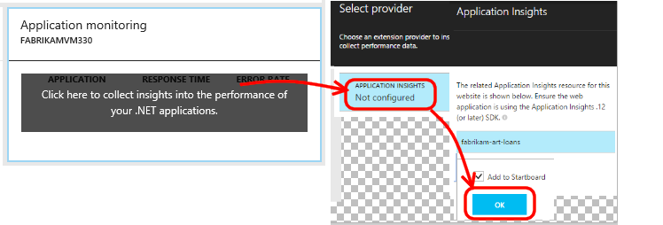

<properties
	pageTitle="Monitor Azure web app performance | Microsoft Azure"
	description="Application performance monitoring for Azure web apps. Chart load and response time, dependency information and set alerts on performance."
	services="application-insights"
    documentationCenter=".net"
	authors="alancameronwills"
	manager="douge"/>

<tags
	ms.service="azure-portal"
	ms.workload="na"
	ms.tgt_pltfrm="na"
	ms.devlang="na"
	ms.topic="article"
	ms.date="09/01/2016"
	ms.author="awills"/>

# Monitor Azure web app performance

In the [Azure Portal](https://portal.azure.com) you can set up application performance monitoring for your [Azure web apps](../app-service-web/app-service-web-overview.md). [Visual Studio Application Insights](app-insights-overview.md) instruments your app to send telemetry about its activities to the Application Insights service, where it is stored and analyzed. There, metric charts and search tools can be used to help diagnose issues, improve performance, and assess usage.

## Run time or build time

You can configure monitoring by instrumenting the app in either of two ways:

* **Run-time** - You can select a performance monitoring extension when your web app is already live. It isn't necessary to rebuild or re-install your app. You get a standard set of packages that monitor response times, success rates, exceptions, dependencies, and so on. 

    **Application Insights** and **New Relic** are two of the runtime performance monitoring extensions that are available.
 
* **Build time** - You can install a package in your app in development. This option is more versatile. In addition to the same standard packages, you can write code to customize the telemetry or to send your own telemetry. You can log specific activities or record events according to the semantics of your app domain. 

    **Application Insights** provides build-time packages. 

## Build the app with the Application Insights package...

Application Insights can provide more detailed telemetry by installing an SDK into your app.

In Visual Studio (2013 update 2 or later), add the Application Insights SDK to your project.

If you're asked to sign in, use the credentials for your Azure account.

The operation has two effects:

1. Creates an Application Insights resource in Azure, where telemetry is stored, analyzed and displayed.
2. Adds the Application Insights NuGet package to your code, and configures it to send telemetry to the Azure resource.

You can test the telemetry by running the app in your development machine (F5), or you can just go ahead and republish the app.

The SDK provides an API so that you can [write custom telemetry](../application-insights/app-insights-api-custom-events-metrics.md) to track usage.

### ...or set up a resource manually

If you didn't add the SDK in Visual Studio, you must set up an Application Insights resource in Azure, where telemetry is stored, analyzed and displayed.

## Enable an extension

1. Browse to the control blade of the web app or virtual machine you would like to instrument.

2. Add the Application Insights or the New Relic extension.

    If you're instrumenting a web app:

Or if you're using a virtual machine:

## Explore the data

1. Open the Application Insights resource (either directly from Browse, or from the Performance Monitoring tool of the web app).

2. Click through any chart to get more detail:

    

    You can [customize metrics blades](../application-insights/app-insights-metrics-explorer.md).

3. Click through further to see individual events and their properties:

    

    Notice the "..." link to open all properties.

    You can [customize searches](../application-insights/app-insights-diagnostic-search.md).

For more powerful searches over your telemetry, use the [Analytics query language](../application-insights/app-insights-analytics-tour.md).

## Q & A

How do I change to send data to a different Application Insights resource?

* *If you added Application Insights to your code in Visual Studio:* Right-click the project, choose **Application Insights > Configure** and choose the resource you want. You get the option to create a new resource. Rebuild and redeploy.
* *Otherwise:* In Azure, open the web app control blade, and open **Tools > Extensions**. Delete the Application Insights extension. Then open **Tools > Performance**, 'click here', choose Application Insights, and then the resource that you want. (If you want to create a new Application Insights resource, do that first.)

## Next steps

* [Enable Azure diagnostics](app-insights-azure-diagnostics.md) to be sent to Application Insights.
* [Monitor service health metrics](../monitoring-and-diagnostics/insights-how-to-customize-monitoring.md) to make sure your service is available and responsive.
* [Receive alert notifications](../monitoring-and-diagnostics/insights-receive-alert-notifications.md) whenever operational events happen or metrics cross a threshold.
* Use [Application Insights for JavaScript apps and web pages](app-insights-web-track-usage.md) to get client telemetry from the browsers that visit a web page.
* [Set up Availability web tests](app-insights-monitor-web-app-availability.md) to be alerted if your site is down.
