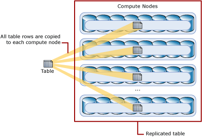

<properties
   pageTitle="Distributed data and distributed table options for the Massively Parallel Processing (MPP) systems of SQL Data Warehouse and Parallel Data Warehouse | Microsoft Azure"
   description="Learn how data is distributed for Massively Parallel Processing (MPP) and the options for distributing tables in Azure SQL Data Warehouse and Parallel Data Warehouse."
   services="sql-data-warehouse"
   documentationCenter="NA"
   authors="barbkess"
   manager="barbkess"
   editor=""/>

<tags
   ms.service="sql-data-warehouse"
   ms.devlang="NA"
   ms.topic="article"
   ms.tgt_pltfrm="NA"
   ms.workload="data-services"
   ms.date="10/10/2016"
   ms.author="barbkess"/>

# Distributed data and distributed tables for Massively Parallel Processing (MPP)

Learn how user data is distributed in Azure SQL Data Warehouse and Parallel Data Warehouse, which are Microsoft's Massively Parallel Processing (MPP) systems. Designing your data warehouse to use distributed data effectively helps you to achieve the query processing benefits of the MPP architecture. A few database design choices can have a significant impact on improving query performance.  

>[AZURE.NOTE] Azure SQL Data Warehouse and Parallel Data Warehouse use the same Massively Parallel Processing (MPP) design, but they have a few differences because of the underlying platform. SQL Data Warehouse is a Platform as a Service (PaaS) that runs on Azure. Parallel Data Warehouse runs on Analytics Platform System (APS) which is an on-premises appliance that runs on Windows Server.

## What is distributed data?

In SQL Data Warehouse and Parallel Data Warehouse, distributed data refers to user data that is stored in multiple locations across the MPP system. Each of those locations functions as an independent storage and processing unit that runs queries on its portion of the data. Distributed data is fundamental to running queries in parallel to achieve high query performance.

To distribute data, the data warehouse assigns each row of a user table to one distributed location.  You can distribute tables with a hash-distribution method or a round-robin method. The distribution method is specified in the CREATE TABLE statement. 

## Hash-distributed tables
  
The following diagram illustrates how a full (non-distributed table) gets stored as a hash-distributed table. A deterministic function assigns each row to belong to one distribution. In the table definition, one of the columns is designated as the distribution column. The hash function uses the value in the distribution column to assign each row to a distribution.

There are performance considerations for the selection of a distribution column, such as distinctness, data skew, and the types of queries run on the system.
  
  
  
-   Each row belongs to one distribution.  
  
-   A deterministic hash algorithm assigns each row to one distribution.  
  
-   The number of table rows per distribution varies as shown by the different sizes of tables.

## Round-robin distributed tables

A round-robin distributed table distributes the rows by assigning each row to a distribution in a sequential manner. It is quick to load data into a round-robin table, but query performance might be slower.  Joining a round-robin table usually requires reshuffling the rows to enable the query to produce an accurate result, which takes time.

## Distributed storage locations are called distributions

Each distributed location is called a distribution. When a query runs in parallel, each distribution performs a SQL query on its portion of the data. SQL Data Warehouse uses SQL Database to run the query. Parallel Data Warehouse uses SQL Server to run the query. This shared-nothing architecture design is fundamental to achieving scale-out parallel computing.

### Can I view the distributions?

Each distribution has a distribution ID and is visible in system views that pertain to SQL Data Warehouse and Parallel Data Warehouse. You can use the distribution ID to troubleshoot query performance and other problems. For a list of the system views, see the [MPP system view](sql-data-warehouse-reference-tsql-statements.md).

## Difference between a distribution and a Compute node

A distribution is the basic unit for storing distributed data and processing parallel queries. Distributions are grouped into Compute nodes. Each Compute node tracks one or more distributions.  

-   Analytics Platform System uses Compute nodes as a central component of the hardware architecture and scale-out capabilities. It always uses eight distributions per Compute node, as shown in the diagram for hash-distributed tables. The number of Compute nodes, and therefore the number of distributions, is determined by the number of Compute nodes you purchase for the appliance. For example, if you purchase eight Compute nodes, you get 64 distributions (8 Compute nodes x 8 distributions/node). 

-   SQL Data Warehouse has a fixed number of 60 distributions and a flexible number of Compute nodes. The Compute nodes are implemented with Azure computing and storage resources. The number of Compute nodes can change according to the backend service workload and the computing capacity (DWUs) you specify for the data warehouse. When the number of Compute nodes changes, the number of distributions per Compute node also changes. 

### Can I view the Compute nodes?

Each Compute node has a node ID and is visible in system views that pertain to SQL Data Warehouse and Parallel Data Warehouse.  You can see the Compute node by looking for the node_id column in system views whose names begin with sys.pdw_nodes. For a list of the system views, see the [MPP system view](sql-data-warehouse-reference-tsql-statements.md).

## Replicated Tables for Parallel Data Warehouse 
  
Applies to: Parallel Data Warehouse

In addition to using distributed tables, Parallel Data Warehouse offers an option to replicate tables. A *replicated table* is a table that is stored in its entirety on each Compute node. Replicating a table removes the need to transfer its table rows among Compute nodes before using the table in a join or aggregation. Replicated tables are only feasible with small tables because of the extra storage required to store the full table on each compute node.  
  
The following diagram shows a replicated table that is stored on each Compute node. The replicated table is stored across all disks assigned to the Compute node. This disk strategy is implemented by using SQL Server filegroups.  
  
 
  
## Next steps
  
To use distributed tables effectively, see [Distributing tables in SQL Data Warehouse](sql-data-warehouse-tables-distribute.md)  
  

  
